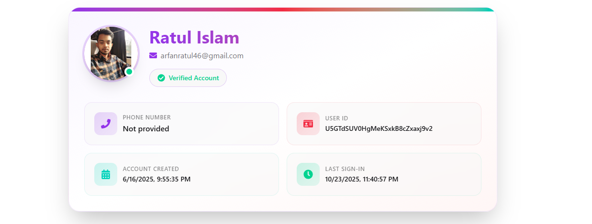

## MY Website Name : Open Journal
## Live Site URL : https://wondrous-paprenjak-d5a5de.netlify.app/
## Server Site URL : https://github.com/ratulislam46/openjournal-server

Open Journal is a modern, fully responsive blogging platform built with React, Tailwind CSS, and DaisyUI. It allows users to read, post, and manage blogs seamlessly. The platform includes user authentication via Firebase, enabling users to sign in with Google, manage their personal wishlists, and track their own blog posts.

Key features like light/dark mode, profile pages, and a dynamic navbar with dropdowns make navigation smooth and user-friendly. The backend, powered by MongoDB, ensures secure storage of blogs and user data.

Purpose & Use:
This project is ideal for anyone looking to publish content online, follow favorite blogs, or maintain a personal blog portfolio. It demonstrates modern web development techniques and provides a clean, responsive, and interactive user experience, making it perfect for learners, bloggers, or developers exploring full-stack React applications.

---

## 🔥 Features

- **Responsive Design** – Mobile-first UI using Tailwind CSS and DaisyUI.  
- **All Blogs Page** – View all published blogs from database.  
- **Featured Blogs Page** – View curated or highlighted blogs.  
- **Add Blog Page** – Logged-in users can add a new blog.  
- **My Profile Page** – Users can view personal information.
- **Wishlist Functionality** – Logged-in users can add blogs to their personal wishlist.  
- **User Authentication** – Firebase-based secure login system (Google Sign In).  
- **Routing** – Built with `react-router-dom` for smooth navigation between all pages.  
- **MongoDB Backend** – Blogs and user data stored securely.  
- **Firebase Hosting** – Deployed and accessible from anywhere.

## Technologies Used

- Frontend: React, Tailwind CSS, DaisyUI, React Router, Framer Motion, Qoder  
- Backend: Node.js, Express.js, MongoDB  
- Authentication: Firebase Authentication  
- Deployment: Firebase Hosting  ;

## 📸 Adding Images to README

