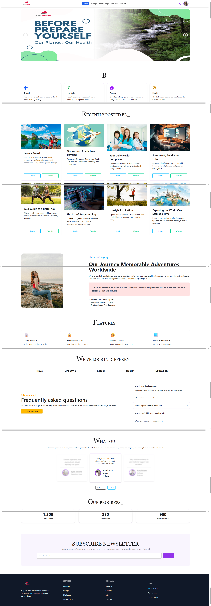

## MY Website Name : Open Journal
## Live Site URL : https://wondrous-paprenjak-d5a5de.netlify.app/

A fully responsive blog application built with **React**, styled using **Tailwind CSS** and **DaisyUI**, powered by **MongoDB** and **Firebase** for authentication. This app features **blog posting**, **wishlist**,**user profile**, **routing**, and **user-based interactivity**.

---

## 🔥 Features

- **Responsive Design** – Mobile-first UI using Tailwind CSS and DaisyUI.  
- **All Blogs Page** – View all published blogs from database.  
- **Featured Blogs Page** – View curated or highlighted blogs.  
- **Add Blog Page** – Logged-in users can add a new blog.  
- **My Profile Page** – Users can view personal information.
- **Wishlist Functionality** – Logged-in users can add blogs to their personal wishlist.  
- **User Authentication** – Firebase-based secure login system (Google Sign In).  
- **Routing** – Built with `react-router-dom` for smooth navigation between all pages.  
- **MongoDB Backend** – Blogs and user data stored securely.  
- **Firebase Hosting** – Deployed and accessible from anywhere.

## Technologies Used

- Frontend: React, Tailwind CSS, DaisyUI, React Router, Framer Motion, Qoder  
- Backend: Node.js, Express.js, MongoDB  
- Authentication: Firebase Authentication  
- Deployment: Firebase Hosting  ;

## 📸 Adding Images to README

